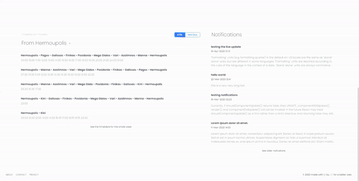

## What is this project about

I'm making this project in order to challenge myself as a junior developer and in the process to learn new things and technologies. The inspiration for this was the almost unusable website that the bus company in Syros(Syros is an island in Greece and also my place of origin) had already so I wanted to make something modern and functional for them. 

The purpose of this webapp is to inform the potential clients of the app about the routes, the times, the rates and all other kind on info concerning the every-day transportation on the island.

The app has a mobile first approach. It is designed as a progressive web app (pwa) to still be funcional offline or in cases when the internet connection is poor.

 

[Progress made so far can been seen here](https://sw-react-test.firebaseapp.com/)

## Template

I used a free react template from [Creative Tim](https://demos.creative-tim.com/black-dashboard-react/#/dashboard) in order to save time and not worry with designing the app. From there I change everything that I didn't needed, build the rest of the site and implement all of it's features.

The template is build over [Bootstrap 4](http://getbootstrap.com/), [Reacstrap](https://reactstrap.github.io/) and [React](https://reactjs.org/) ([create-react-app](https://github.com/facebook/create-react-app)). It comes with two versions, Dark Mode and Ligth Mode. 

## Libraries used

The whole project is backed up by [Firebase](https://firebase.google.com/), I used the Firebase Firestore for handling the queries, Firebase Storage for storing images served in the site and finally the site is hosted in Firebase's hosting service.   

I also used [Redux](https://redux.js.org/) and [React-Redux](https://react-redux.js.org/) to manage state, [react-redux-firestore](https://react-redux-firebase.com/) to connect with Firestore, [date-fns](https://date-fns.org/) for for manipulating dates and time. For the maps I used [Leaflet](https://react-leaflet.js.org/) and the [mapbox direction api](https://docs.mapbox.com/help/glossary/directions-api/) for showing the routes on the map.  

Due to the nature of the app it is neccessery to have available at least two languages (Greek for the locals and English for foreigners). So I used [react-i18next](https://react.i18next.com/) which is based on [i18next](http://i18next.com/). 

## Future of the bus project

The idea is to eliminate all possible annoyance for the end user (and right now there are many) and make the bus taking as ease as it gets. So in the future I want to implement location tracking for every bus in the street, in this way the times will be more accurate and the wait in the bus stop not knowing if the bus have passed already or not will be over. 

To do that and also keep the cost to minimum the GSM/GPS solution is out of the picture. After some research, and to my surprise, I found out that on the island there is a LoRa network setup that covers the whole island (who would have thought, right?). So my plan is to use LoRa for bus tracking, I don't know if it's feasible at all but this is the idea thus far.

*Image from [ttnmapper.org](https://ttnmapper.org/) showcasing the network coverage on the island*

## Licence

Copyright (c) 2020 John Roussos

Permission is hereby granted, free of charge, to any person obtaining a copy of this software and associated documentation files (the "Software"), to deal in the Software without restriction, including without limitation the rights to use, copy, modify, merge, publish, distribute, sublicense, and/or sell copies of the Software, and to permit persons to whom the Software is furnished to do so, subject to the following conditions:

The above copyright notice and this permission notice shall be included in all copies or substantial portions of the Software.

THE SOFTWARE IS PROVIDED "AS IS", WITHOUT WARRANTY OF ANY KIND, EXPRESS OR IMPLIED, INCLUDING BUT NOT LIMITED TO THE WARRANTIES OF MERCHANTABILITY, FITNESS FOR A PARTICULAR PURPOSE AND NONINFRINGEMENT. IN NO EVENT SHALL THE AUTHORS OR COPYRIGHT HOLDERS BE LIABLE FOR ANY CLAIM, DAMAGES OR OTHER LIABILITY, WHETHER IN AN ACTION OF CONTRACT, TORT OR OTHERWISE, ARISING FROM, OUT OF OR IN CONNECTION WITH THE SOFTWARE OR THE USE OR OTHER DEALINGS IN THE SOFTWARE.
